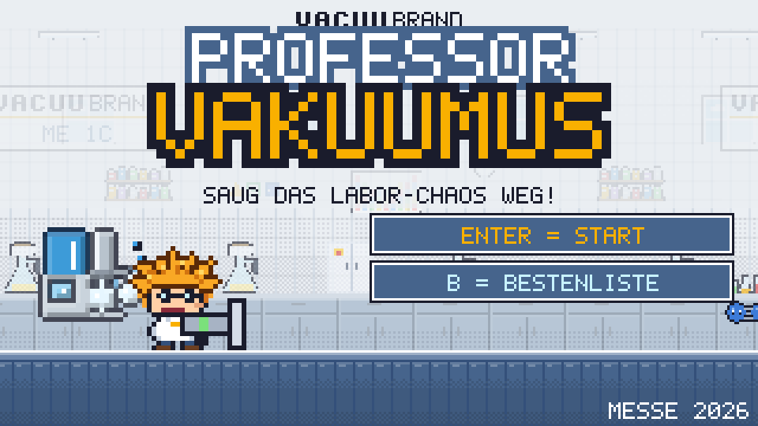
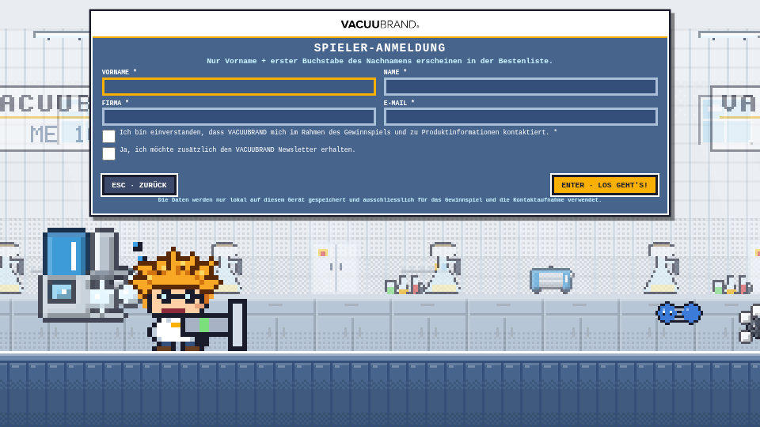
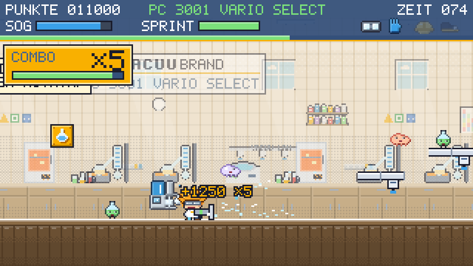
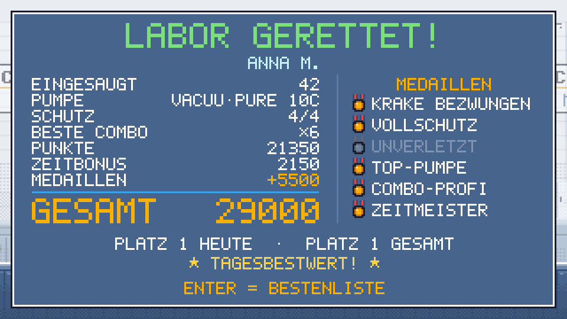
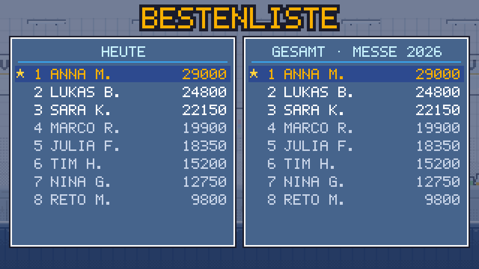
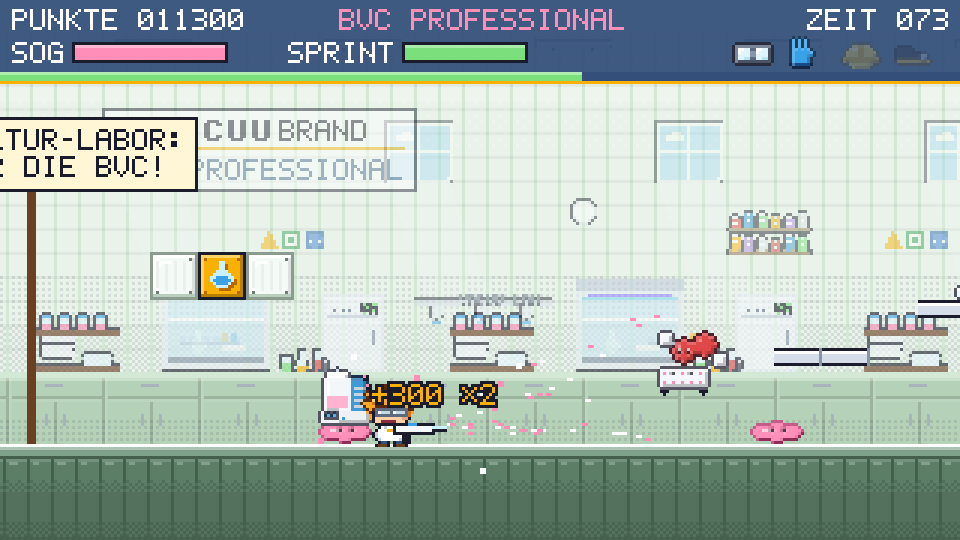
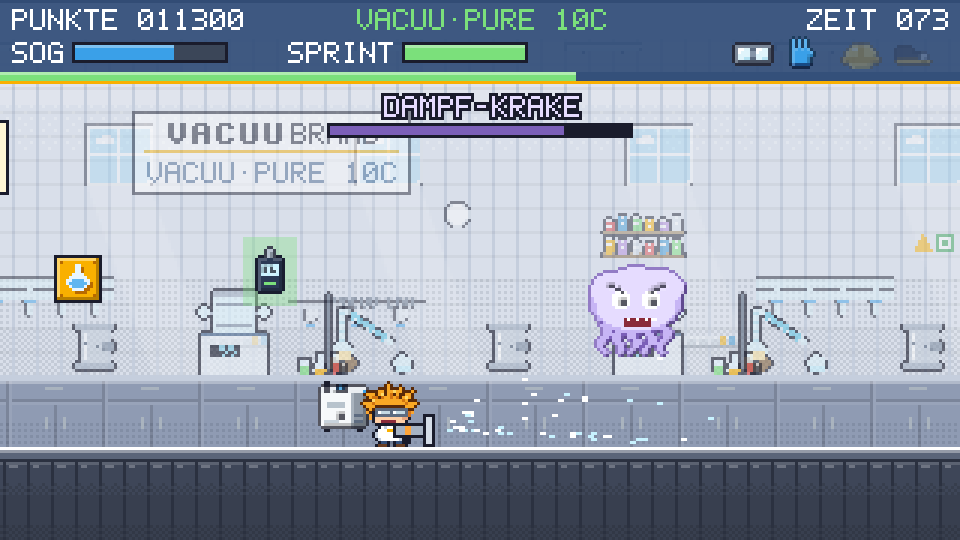

# 🧪 Professor Vakuumus

### Das VACUUBRAND Messespiel: Besucher an den Stand holen, Produkte zeigen, Kontakte sammeln

---

## 🎯 Worum geht's?

Professor Vakuumus ist ein kurzes Jump'n'Run im Stil der alten Nintendo-Spiele. Ein verrückter Laborprofessor mit wilden orangen Haaren räumt mit seiner Saugpistole das Labor auf. Auf dem Rücken trägt er eine VACUUBRAND Pumpe, und die wird im Lauf der Runde immer stärker.

Eine Runde dauert **2 Minuten**. Das ist lang genug, dass es Spass macht, und kurz genug, dass am Stand keine Schlange entsteht.

Vor dem Spielen melden sich die Besucher mit Namen, Firma und E-Mail an. Wer die meisten Punkte holt, gewinnt einen Preis.

---

## 💡 Was bringt das VACUUBRAND?

| | |
|---|---|
| 👀 **Aufmerksamkeit** | Auf dem Bildschirm läuft dauernd eine bunte Demo. Die fällt im Messegang auf und lockt Leute an den Stand. |
| 📇 **Leads** | Jeder Spieler gibt Vorname, Name, Firma und E-Mail an, mit Einwilligung zur Kontaktaufnahme. Die Anmeldung zum Newsletter ist freiwillig und wird separat erfasst. |
| 🔬 **Produkte spielerisch erklärt** | Jedes Level ist eine echte Laboranwendung mit der passenden Pumpe. Die Besucher sehen ME 1C, BVC professional, PC 3001 VARIO select und VACUU·PURE 10C im Einsatz. |
| 💬 **Gesprächseinstieg** | „Welche Pumpe hattest du am Schluss?“ ist ein einfacher Einstieg ins Fachgespräch. |
| 🏆 **Wiederkommen** | Es gibt eine Tages- und eine Gesamt-Bestenliste. Wer knapp verloren hat, kommt oft nochmals vorbei. |

---

## 🕹️ So läuft das am Stand

**1. Anmelden** 📝
Vorname, Name, Firma, E-Mail und das Häkchen für die Einwilligung. Unter dem Formular saugt der Professor schon mal Laborchaos weg.

**2. Spielen** 🎮
Laufen, springen und saugen, mit Tastatur, Gamepad oder Joystick. Aus den Kolben-Blöcken kommen stärkere Pumpen und Schutzausrüstung.

**3. Ergebnis und Medaillen** 🥇
Punkte, Zeitbonus, Medaillen und die Platzierung von heute und von der ganzen Messe.

**4. Bestenliste** 🏆
Öffentlich erscheint nur „Vorname N.“, also keine vollen Namen und keine Firmen.

---

## 🧪 Vier Labore, vier Pumpen

| Level | Pumpe | Anwendung im Spiel |
|---|---|---|
| 1️⃣ Filtrationslabor | **ME 1C** | Filtration |
| 2️⃣ Zellkultur-Labor | **BVC professional** mit VHC-Handstück | Medienabsaugung aus Wellplatten und Petrischalen |
| 3️⃣ Verdampfer-Labor | **PC 3001 VARIO select** | Rotavap, Vakuum-Konzentrator, Trockenschrank |
| 4️⃣ Hochvakuum-Technikum | **VACUU·PURE 10C** | Ölfreie Trocknung: Gefriertrocknung, Schlenk-Line, Turbo-Vorvakuum |

Am Schluss wartet die **Dampf-Krake** 🐙. Die schafft nur die VACUU·PURE 10C.

Die Plattformen im Spiel sind **VACUU·LAN** Leitungen, und die **VACUU·VIEW extended** gibt als „Zeitvakuum“ 10 Sekunden extra. So tauchen weitere Produkte ganz nebenbei auf.

---

## ⭐ Was alles drin ist

🔋 **Stärkere Pumpen.** Jede neue Pumpe hat mehr Reichweite und mehr Saugkraft. Beim Upgrade erscheinen Produktname und Anwendung.

🦺 **Schutzausrüstung.** Schutzbrille, Handschuhe, Schutzhelm und Sicherheitsschuhe haben je einen Vorteil im Spiel. Wer alle vier hat, spielt mit „Vollschutz“. Das Thema Laborsicherheit kommt damit ganz nebenbei ins Spiel.

🔥 **Combo-Serien.** Wer schnell hintereinander einsaugt, bekommt bis zu achtfache Punkte. Ein grosser goldener Kasten zeigt die Serie und einen ablaufenden Timer.

🥇 **Sechs Medaillen** mit Bonuspunkten, zum Beispiel „Krake bezwungen“, „Vollschutz“ oder „Unverletzt“. Damit gibt es auch nach einer guten Runde noch etwas zu jagen.

⏱️ **Zeitleiste.** Die restliche Zeit läuft als farbiger Balken ab, von Grün über Gelb zu Rot.

🎵 **8-Bit-Musik und Sound.** Jedes Labor hat eine eigene Melodie, der Endgegner ein eigenes Thema. Wenn der Professor getroffen wird, ruft er „Autsch!“.

🎮 **Tastatur, Gamepad und Joystick.** Ein Xbox- oder USB-Controller wird automatisch erkannt. Das sieht am Stand hochwertiger aus und schont die Laptop-Tastatur.

🔬 **Echte Laborgegner.** Reagenzgläser, Eppis, Rundkolben, Wellplatten, Lösemitteldampf und Moleküle wie H₂O, O₂, N₂ oder Ethanol als Kugelmodelle.

---

## 🏆 Bestenliste und Preise

- **Tages-Bestenliste**, damit es jeden Tag einen Gewinner gibt
- **Gesamt-Bestenliste** über die ganze Messe für einen Hauptpreis
- Wer mehrmals spielt, zählt mit seinem besten Ergebnis
- Das Standpersonal sieht im Admin-Bereich die Top 3 von heute und von der ganzen Messe mit den vollen Kontaktdaten und kann die Gewinner direkt anrufen oder anschreiben

---

## 📇 Leads und Datenschutz 🔒

- Alle Daten bleiben **nur auf dem Messe-Laptop**. Es wird nichts ins Internet geschickt.
- Export als **Excel-Datei (CSV)**: eine Liste mit allen Kontakten, eine mit allen gespielten Runden. Die Kontakte können danach direkt ins CRM oder an den Vertrieb.
- Die Einwilligung ist Pflicht, der Newsletter freiwillig und separat angekreuzt.
- Nach der Messe löscht ein Knopf alle Daten.
- 👉 Den Einwilligungstext sollte die Datenschutzstelle vor dem ersten Einsatz noch einmal anschauen. Er lässt sich in einer Datei ändern, ohne Programmierkenntnisse.

---

## 💻 Was es braucht

| | |
|---|---|
| 🖥️ Hardware | Ein normaler Firmen-Laptop. Mit einem grossen Bildschirm oder TV daneben wirkt es natürlich am besten. |
| 🎮 Optional | Ein USB-Gamepad oder Joystick |
| 📦 Installation | Keine. Ordner kopieren, Doppelklick, läuft. |
| 🌐 Internet | Nicht nötig, das Spiel läuft komplett offline |
| 💰 Lizenzen | Keine. Das Spiel ist selbst entwickelt, ohne fremde Software oder Abos. |

---

## ⚙️ Anpassbar für jede Messe

- Messename auf dem Startbildschirm (z. B. „ILMAC 2026“)
- Rundenzeit
- Admin-PIN
- Texte der Anmeldung und der Einwilligung
- Pumpen-Slogans, Punkte und Zeitbonus

Die ersten drei gehen direkt im Admin-Bereich, der Rest in einer gut kommentierten Einstellungsdatei.

---

## ✅ Nächste Schritte bis zur Messe

1. 🔒 Einwilligungstext mit dem Datenschutz abstimmen
2. 🎁 Preise festlegen (Tagespreis und Hauptpreis)
3. 🖥️ Laptop, Bildschirm und eventuell ein Gamepad organisieren und einmal durchtesten
4. 🔑 Admin-PIN ändern und das Standpersonal kurz einweisen

---

📖 **Anleitung fürs Standpersonal** mit Steuerung, Admin-Bereich, Export und Tipps: [ANLEITUNG.md](ANLEITUNG.md)

🚀 **Starten:** Doppelklick auf `Spiel starten (Vollbild).bat` oder auf `index.html`
